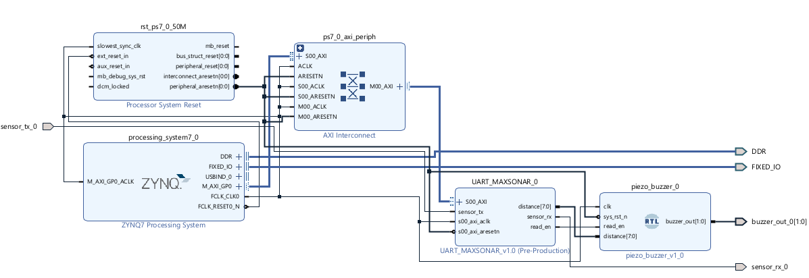

# ECE 520 - Ultrasonic Proximity Alarm

# Introduction

This project uses an ultrasonic distance sensor to detect how close an object is to the sensor and trigger an audible alarm when the object moves within a certain distance range. The system produces sound based on the distance between the object and the ultrasonic sensor.

The purpose of this project is to create a simple embedded system that combines distance sensing and audio feedback. The ultrasonic sensor measures the distance of nearby objects, while the PL processes the sensor data and activates the two piezo buzzers when the measured distance reaches a programmed threshold. The alarm sound varies depending on the distance threshold, allowing the system to indicate how close the object is to the sensor.

This is the final project for ECE 520 at California State University, Northridge (CSUN).

Completed by:

* Rodrigo Espinoza

Professor

* Aaron Nanas

# Project Goals

* To design a system that detects the distance between an object and an ultrasonic sensor.
* To activate an audible alarm when an object is close to the sensor.
* To design a custom UART module specifically for the PMOD Maxsonar sensor.
* To gain experience with sensor interfacing, embedded programming, and hardware-software integration.

# Block Diagram

# Video Demonstration

Video Demo: https://www.youtube.com/shorts/LvjLVKrKrXA

# Background and Methodology

The system was developed using a Pmod MAXSONAR ultrasonic distance sensor, a Zybo Z7-10 FPGA board, and two piezo buzzers. The ultrasonic sensor sends out sound waves and measures the time it takes for the echo to return after bouncing off an object. This time value is then used to determine the distance between the object and the sensor.

The designed UART module is used to control the Rx pin of the Pmod sensor and receive packets of data from the sensor when enabled. Once the distance measurement is captured, it is sent to another module that generates square waves at different frequencies depending on the distance threshold. These square waves are then sent to the buzzers to produce audible tones.

The project was tested by placing objects at different distances in front of the ultrasonic sensor and observing the buzzer response. Different sound frequencies were produced during testing, showing that the alarm output changed based on the measured distance.

# Results

The ultrasonic proximity alarm was successfully able to detect objects within a selected distance range and produce an audible warning when an object moved close to the sensor. However, the issue was that the system did not respond in real time by continuously checking the distance. This could be due to a bug possibly found in the receiver module in how data from the peripheral is received and handled. By tackling this issue, this project may work in real time.

# Components Used

* **Board:** Zybo Z7-10
* **Sensor:** Pmod MAXSONAR
* **Output:** 2 Piezo Buzzers
* **Wiring:** Jumper Cables
